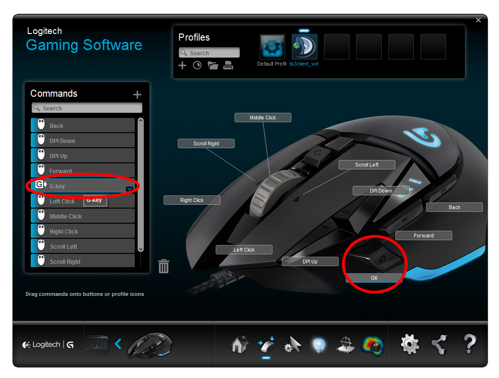

# TeamSpeak 3 G-Key Plugin

This plugin provides support for Logitech devices with G-Keys for hotkeys. This allows you to use these macro keys directly without rebinding them to standard keyboard keys.

## Usage

Download and install the latest version from the releases or from [myteamspeak.com](https://www.myteamspeak.com/).

Once installed G-Keys can be configured like any other hotkey, however by default these hotkeys can only be used when TeamSpeak 3 is in focus.

To use these hotkeys with any application active you need to make TeamSpeak 3 the persistent profile in the Logitech Gaming Software:

### Mouse buttons

Most logitech mice do not have G-Keys, but the existing buttons can still be reassigned as G-Keys in the Logitech Gaming Software:

If you cannot find the G-Key item, make sure you switch your mouse to use "Automatic Game Detection" instead of "On-Board Memory".

## License

The plugin is licensed under the MIT license.

The TeamSpeak 3 Plugin SDK and the Logitech G-Key SDK have their own respective licenses.
